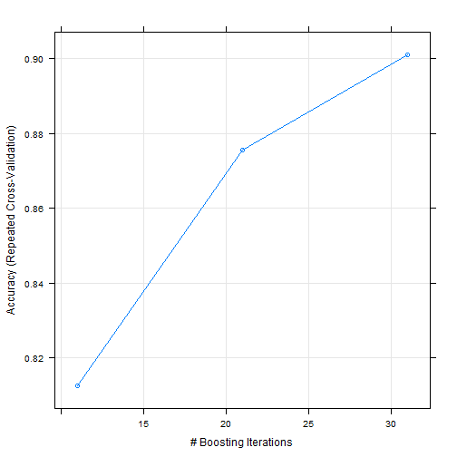
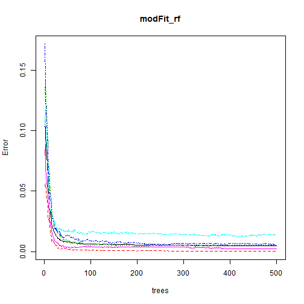
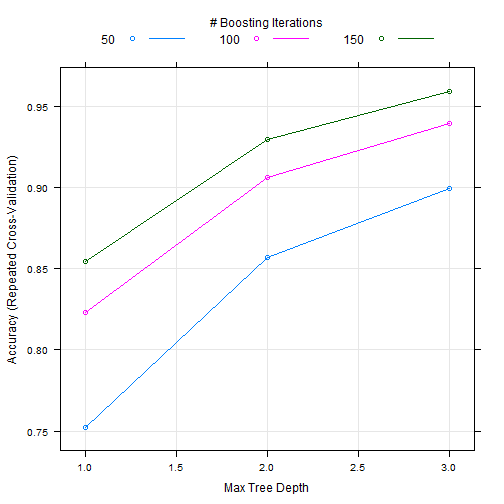
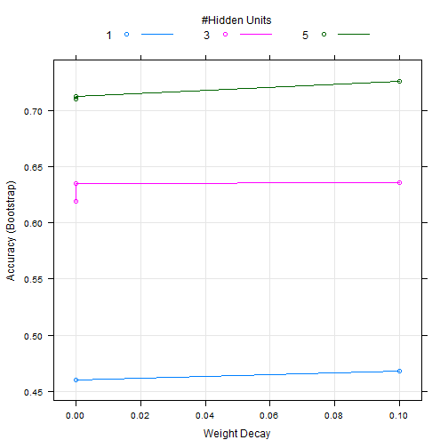
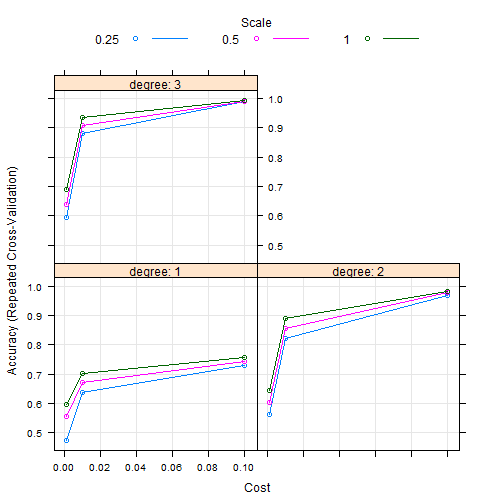

Coursera Practical Machine Learning Course Project - Weight Lifting Exercise Predition
=======================================================================================

##Synopsis
The Project is based on the [Weight Lifting Exercise Dataset](http://groupware.les.inf.puc-rio.br/har).   
One thing that people regularly do is quantify how much of a particular activity they do, but they rarely quantify how well they do it. In this project, your goal will be to use data from accelerometers on the belt, forearm, arm, and dumbell of 6 participants. They were asked to perform barbell lifts correctly and incorrectly in 5 different ways.  

Six young health participants were asked to perform one set of 10 repetitions of the Unilateral Dumbbell Biceps Curl in five different fashions: exactly according to the specification (Class A), throwing the elbows to the front (Class B), lifting the dumbbell only halfway (Class C), lowering the dumbbell only halfway (Class D) and throwing the hips to the front (Class E).  
This information is incorporated in the "classe"-variable!  
Based on this analysis a Random Forest Model, (Polynomial) Support Vector Machine and Generalized Boosted Model perform best in this setting with accuracies of ~99%.

[Read more!](http://groupware.les.inf.puc-rio.br/har#dataset#ixzz3BbHyyJ3e)

We compare the following machine learning algorithms for multiclass classification on the Weight Lifting Excercise Dataset:
- Logit Boost
- Random Forests
- Generalized Boosted Model
- Neural Network
- Support Vector Machine

# Data Preprocessing

## Load needed libraries

```r
library("caret")
library("caTools")
library("gbm")
library("ggplot2")
library("randomForest")
library("kernlab")
library("xtable")
```

## Load and tidy up data
We load the data into R. A lot of the columns contain mainly "NA"s, so we delete all these columns. The first seven columns contain information like the names and timestamps that cannot be used is input to a machine learning algorithm, so we delete them as well.

```r
# Load the training set
pml_training <- read.csv("pml-training.csv", na.strings=c("","NA"))
# Delete all columns that contain NAs
pml_train_nona<-pml_training[,colSums(is.na(pml_training))== 0]
#Delete the first 7 columns
pml_train_nona<- pml_train_nona[,8:ncol(pml_train_nona)]

# Load the evaluation data
pml_testing <-read.csv("pml-testing.csv", na.strings=c("","NA"))
# Delete all columns that contain NAs
pml_test_nona<-pml_testing[,colSums(is.na(pml_testing))== 0]
#Delete the first 7 columns
pml_test_nona<- pml_test_nona[,8:ncol(pml_train_nona)]
```
Based on the instructions, we will only use the 20 examples from the pml_testing set for the Prediction Assignment and therefore ignore this data for this report.  

## Data Partitioning
Hence, we partition the training set into training (75%) and test set (25%). Let me emphasize the distinction between test set (as part of the given training set) and the pml_testing set (that will only be used for the Prediction Assigment).  


```r
set.seed(3433)

inTrain = createDataPartition(y=pml_train_nona$classe, p = 0.75, list=FALSE)
training = pml_train_nona[ inTrain,]
testing = pml_train_nona[-inTrain,]
```

We will use 4-fold cross-validation for each of the proposed algorithms and begin with normalizing the features we want to use to predict the target variable "classe".


```r
#Set train parameters. We 
cv <- trainControl(method = "repeatedcv", repeats = 1, number=4, allowParallel=TRUE, verboseIter=TRUE)
preObj <- c("center", "scale")
```

## Logit Boost Model

```r
# LogitBoost

modFit_LB <- train(classe~., data=training,
             preProcess=preObj,
             method = 'LogitBoost',
             nIter = 5,
             trControl =cv,
             verbose=FALSE)
predictions_LB <- predict(modFit_LB,testing)

# accuracy
acc_LB<- sum(predictions_LB==testing$classe, na.rm=TRUE)/length(testing$classe)

#Plot
plot(modFit_LB)
```

 

## Random Forest
For the Random Forest Model we use the radomForest function instead of the caret package since it takes just a small percentage of the processing time (~30sec). No featue normalization is needed for this algorithm.

```r
modFit_rf <- randomForest(classe~., ntree=500, data=training)

predictions_RF <- predict(modFit_rf,testing)
acc_RF<- sum(predictions_RF==testing$classe)/length(testing$classe)

#Plot
plot(modFit_rf)
```

 

## Generalized Boosted Model
We now train the Generalized Boosted Model:

```r
# Generalized Boosted Model
modFit_gbm <- train(classe ~ ., data=training,
                preProcess= preObj,
                method="gbm",
                trControl=cv,
                verbose=FALSE)
predictions_GBM <- predict(modFit_gbm, testing)
acc_GBM<- sum(predictions_GBM==testing$classe)/length(testing$classe)

# Plot
plot(modFit_gbm)
```

 

## Neural Network

```r
## Neural Network Model
modFit_NNET <- train(classe ~ ., data=training,
                     preProc=preObj,
                     method='nnet', 
                     trace = FALSE)

predictions_NNET <- predict(modFit_NNET, testing)                                         
acc_NNET <- sum(predictions_NNET==testing$classe)/length(testing$classe)

#Plot
plot(modFit_NNET)
```

 

## Polynomial Support Vector Machine

```r
## Support Vector Machine with Polynomials
modFit_svn <- train(classe ~ ., 
                data=training,
                preProcess= preObj,
                method="svmPoly",
                trControl=cv,
                verbose=FALSE
                )
predictions_svn <- predict(modFit_svn, testing)
acc_SVN<- sum(predictions_svn==testing$classe, na.rm=TRUE)/length(testing$classe)

# Plot
plot(modFit_svn)
```

 
# Results
The accuracies of the tested models are summarized in the following table:


```r
accuracyTable <- format(rbind(acc_GBM, acc_LB, acc_NNET, acc_RF, acc_SVN), digits=4)
colnames(accuracyTable) <- c( "Accuracy")
rownames(accuracyTable)<- c("Generalized Boosted Model", "Logit Boost", "Neural Network", "Random Forest", "Support Vector Machine")
xt<- xtable(accuracyTable)
print(xt, type="html")
```

<!-- html table generated in R 3.1.0 by xtable 1.7-3 package -->
<!-- Sat Aug 30 10:39:51 2014 -->
<TABLE border=1>
<TR> <TH>  </TH> <TH> Accuracy </TH>  </TR>
  <TR> <TD align="right"> Generalized Boosted Model </TD> <TD> 0.9633 </TD> </TR>
  <TR> <TD align="right"> Logit Boost </TD> <TD> 0.7288 </TD> </TR>
  <TR> <TD align="right"> Neural Network </TD> <TD> 0.7329 </TD> </TR>
  <TR> <TD align="right"> Random Forest </TD> <TD> 0.9963 </TD> </TR>
  <TR> <TD align="right"> Support Vector Machine </TD> <TD> 0.9929 </TD> </TR>
   </TABLE>

The Generalized Boosted Model, Support Vector Machine and Random Forests obtain an excellent accuracy on the training set, whereas the Logit Boost algorithm is only prediciting correctly in 72% of the cases. The Neural Network model shows a similar accuracy of 73%.  
Hence the Random Forest Model should be the most appropriate choice in this specific setting.

